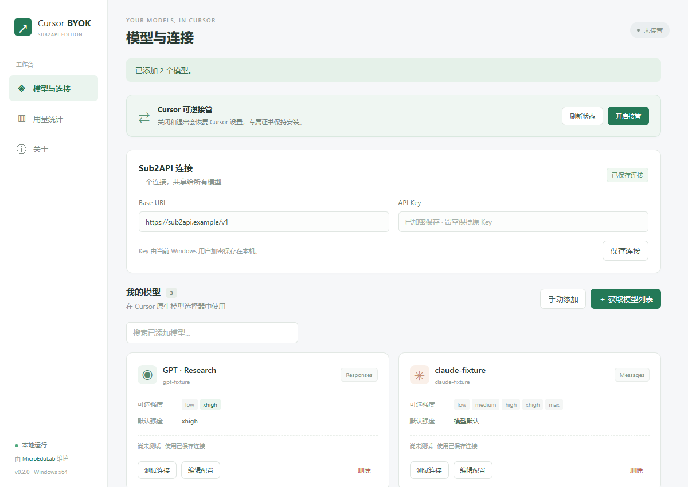
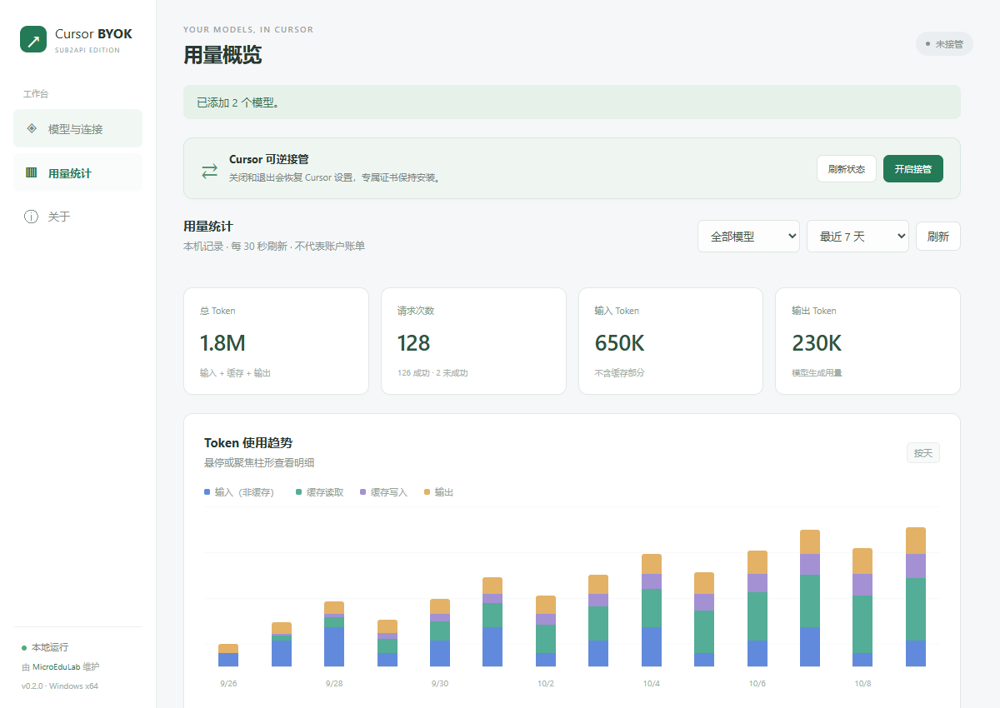

# Cursor Sub2API BYOK

Windows x64 便携控制器，只负责 Cursor → Sub2API。由 **[MicroEduLab](https://microedulab.com/)** 开发与维护。

[下载 Release](https://github.com/dude1wudv/cursor-sub2api-byok/releases) · [开发仓库](https://github.com/dude1wudv/cursor-sub2api-byok) · [反馈问题](https://github.com/dude1wudv/cursor-sub2api-byok/issues) · [更新记录](CHANGELOG.md) · [验证范围](docs/VALIDATION.md)

基于 [leookun/cursor-byok](https://github.com/leookun/cursor-byok) 固定提交 `7ee68c2b7fef66a0e0279273d037d23fbc2f11ad`，保留上游 Git 历史、原 MIT LICENSE 和版权。本项目独立维护，不隶属于 Cursor。

## 下载与要求

从 Release 下载 `Cursor-Sub2API-BYOK-windows-x64.zip`，解压后运行 EXE。包内含原 LICENSE、THIRD-PARTY-NOTICES.txt 和 SHA256SUMS.txt；Release 另提供完整资产校验和。

- Windows x64、Microsoft Evergreen WebView2、有效的 Sub2API Base URL/Key，以及自己的 Cursor 登录环境。
- MicroEduLab 是维护者署名；**EXE 未做 Authenticode 数字签名**，可能出现 SmartScreen 提示。
- 开发预发布版本；GLM 原生子代理新建、续接、并行后台和打开子对话已实测；**Cursor 3.23.12 单独取消仍失败，GPT/Claude/MCP 与活跃重连未真实验收**。详见[验证范围](docs/VALIDATION.md)。

## 功能

- 一个连接共享给多个 GPT/Claude 模型，默认使用 Responses/Messages，可选 Chat Completions。
- `/v1/models` 获取可用模型，搜索、勾选并批量添加；仍支持手动配置。
- 每个模型独立设置可选推理强度与默认强度，在 Cursor 原生选择器切换。
- 浅色蓝紫玻璃工作台、可折叠连接摘要、模型卡片、连接测试反馈、按时间和模型筛选的输入/输出/缓存 Token 统计。
- 启停通过可恢复事务管理 JSONC settings 和本地代理；专属证书首次授权安装，卸载时清理。
- Key、CA 私钥和 journal 由 Windows CurrentUser DPAPI 加密。
- 管理 API 仅在 loopback 上使用随机 token，并校验 Host/Origin。
- 保留 Cursor 自带 rules/Skills/MCP、工具、取消、检查点与 compaction；不添加软件 rules。

## 使用

1. 安装 Microsoft [Evergreen WebView2 Runtime](https://developer.microsoft.com/microsoft-edge/webview2/)；程序不会静默安装运行时。
2. 完全退出 Cursor，打开 `Cursor-Sub2API-BYOK.exe`，阅读并勾选首次使用说明，安装当前用户专属证书。
3. 保存 Sub2API HTTPS 根地址或 `/v1` 与专用 API Key，点击“获取模型列表”勾选添加。按模型名称预选 Responses/Claude Messages，添加前可调整协议。编辑模型卡片设置可选强度与默认值；只勾选上游支持的档位。
4. 完全退出 Cursor，点击“开启接管”，再手动打开 Cursor 并使用原生登录。若尚未授权，完成首次说明与安装后会继续开启；已有授权不会重复弹出应用协议。
5. 窗口 × 会隐藏到系统托盘，继续保持接管；点击托盘图标可重新打开控制台。完全退出 Cursor 后点击“关闭并恢复”，或在托盘菜单选择“退出并恢复”。显式退出时，Cursor 仍运行或恢复失败会阻止退出并重新显示窗口。

本程序不修改 Cursor 安装文件、hosts 或系统代理。默认不修改账号数据库；可选临时订阅缓存仅在明确同意后写入当前 profile 的两个缓存字段，不切换登录、不改变官方权限或账单。官方账号/计费流量继续转发到 Cursor。原生工具、MCP、Skills、检查点、取消和 compaction 仍使用上游实现。

### 原生子代理与会话路由

继续使用 Cursor 的 Task、子对话卡片和 `.cursor/agents/*.md` 自定义子代理。模型优先级为本次明确指定 → 原生类型设置／自定义 agent 的 `model` → 父模型；禁用类型保持禁用。Cursor 3.23.12 的内置类型模型设置目前只直接提供 Explore，自定义类型通过 Cursor 原生 agent 配置管理，并非本程序新增统一选择器。

BYOK 使用 Cursor 模型目录中的实际 ID；工具会收到已配置模型的名称与路由 ID。官方模型仍走 Cursor 官方并受原账号权限约束。同模型继承推理参数，显式选择其他模型使用其原生选择参数；续接已有子代理时保留原子会话模型。失败结果若带子对话 ID，也会保留供 Cursor 打开查看。

已知限制：Cursor 3.23.12 子卡片的单独 Stop 会在 agent-host 客户端丢弃取消动作；后台列表 Stop 的本轮实测也未终止子任务。3.24.12 静态审查仍存在相同的子卡片取消缺口，新版真实模型行为尚未复验。不要将卡片短暂显示 Stopped 视为已停止用量。尚未修改 Cursor 安装文件，也没有用父模型代做或伪造完成来绕过问题。

GPT 的 `prompt_cache_key` 按 Cursor 对话 ID 哈希生成，同一对话跨轮次稳定，不同对话和子代理隔离。它为 Sub2API 提供稳定的粘滞标识，不能保证上游账号限流、余额不足或失效时仍不切换。新版本首次使用会从旧的全局标识切换为对话标识，可能发生一次重新绑定。

## 诊断、模型与网络

- **调用记录**：分页与时间、模型、结果筛选；仅显示必要元数据、脱敏错误、HTTP 状态、耗时、首响应、Token、缓存和关联 ID。请求诊断区分本地协议路由和官方转发，可追踪父请求或 Task ID。默认不采集完整对话。
- **模型管理**：批量测试可取消对应请求，逐模型显示结果；复制模型共享连接 Key，分组与排序持久化。测试会产生所选模型的真实用量，仅在点击后执行。
- **用量与费用**：自选日期、多模型与本地时区贡献日历；缓存读取率使用总输入加权汇总。单价按每百万 Token 配置输入、输出、缓存读、缓存写及币种。费用是“本地估算”，当前价格应用于所选历史区间，未定价模型单独标出，不代表 Sub2API 账单。
- **网络**：分别设置应用出站代理、loopback 接管端口与管理端口。代理失败不自动转直连；代理密码用 DPAPI 保护。管理端口重启生效，接管端口下次开启生效，0 表示自动分配。接管期间锁定变更。
- **临时订阅缓存**：网络页面默认关闭，每次手动同意后临时设置 `ultra / active`。会改变客户端门控，可能随 Cursor 遥测发送，但不会提升官方真实权限。官方刷新可覆盖，本工具不持续强写。关闭、退出或崩溃恢复时只还原仍等于注入值的缓存及派生 JSON 叶字段，保留第三方变化；账号归属变化则不恢复旧账号值。必须完全退出 Cursor 才能操作。详见 [字段与恢复边界](docs/account-injection.md)。

## 界面

以下预览使用合成模型与统计数据。




## 数据与恢复

默认数据目录 `%LOCALAPPDATA%\CursorSub2APIByok`；默认目标 `%APPDATA%\Cursor\User\settings.json`。API Key、CA 私钥及恢复 journal 使用 Windows CurrentUser DPAPI，仅当前 Windows 用户可解密，不能直接迁移到其他用户或机器。

```powershell
.\Cursor-Sub2API-BYOK.exe --data-dir "E:\Isolated Test\Data" --cursor-user-data-dir "E:\Isolated Test\Cursor Profile"
.\Cursor-Sub2API-BYOK.exe --restore --data-dir "E:\Isolated Test\Data" --cursor-user-data-dir "E:\Isolated Test\Cursor Profile"
```

`--cursor-user-data-dir` 指向用户数据根，接管操作其 `User\settings.json`；可选订阅缓存操作同一 profile 的 `User\globalStorage\state.vscdb`。路径须为绝对路径且不能经过 reparse point；GUI 与恢复命令全局单实例互斥。

首次同意使用说明后生成专属 CA，只安装到 CurrentUser Root。Windows 首次安装和最终删除时可能要求确认；核对名称为 `Cursor Sub2API BYOK Local CA` 后点击“是”。关闭接管、托盘退出、崩溃恢复与 `--restore` 恢复 settings 并停止代理，**保留已同意持续安装的证书**，因此无需反复确认。v0.1.0 遗留事务仍按当时记录恢复临时信任。卸载前请进入“关于 → 卸载证书并恢复”，成功后再删除便携程序；模型配置和统计保留。证书按 DPAPI 同意记录的完整 DER 精确删除，失败保留记录供重试；不要提前删除数据目录。原 JSONC 的 BOM、CRLF、注释及无关字段保留。用户在接管期间改成第三值的管理项保留并提示，无法确认归属时保留 journal 并进入 `recovery_required`。

崩溃后使用相同参数重新启动或执行 `--restore`。恢复命令不启动代理或网络客户端，成功返回 0，冲突返回非零。不要删除 `takeover-journal.dpapi` 或复制其他用户的数据目录来绕过恢复。

## 本地构建

需要 Windows x64、MSVC/Rust、pnpm 9、Node 和 Python 3。

```powershell
cargo test -p cursor-server --lib --tests
pwsh -NoProfile -File scripts/build-portable.ps1
```

脚本执行 frozen install、两个 TypeScript 检查及 `tauri build --no-bundle`，交付 EXE、LICENSE、THIRD-PARTY-NOTICES.txt、SHA256SUMS.txt 和相邻 ZIP。默认输出 `dist/windows-x64`，可用 `-OutputDirectory <absolute-path>` 指定目录。没有安装器、自动更新或开机自启。

自动化测试使用临时数据、合成 Key 与 loopback fixture。真实 Cursor/GPT/Claude/MCP 闭环必须使用用户自行登录的专用环境和专用 Key 单独验收。

## 开发结构

```text
apps/desktop/src/          # 连接、模型、接管状态及 MicroEduLab 关于页
apps/desktop/src-tauri/    # Windows 入口、单实例、窗口与退出流程
server/src/local_app/     # JSONC、DPAPI、CA、journal 与代理事务
server/src/control/       # 管理鉴权与控制 API
server/src/store/         # SQLite 与共享连接/模型原子同步
server/src/cursor/        # Cursor 原生协议、工具与会话生命周期
scripts/                 # 便携打包、依赖许可及隔离原生验证
```

数据流：Cursor → 本地 loopback 代理 → 原生协议适配 → Sub2API；账号、计费等官方流量继续转发 Cursor。GitHub Windows CI 执行前端检查、隔离服务端测试及原生编译检查；公开 Release 由维护者验证本地资产后发布，不使用上游 updater 发布链。

## 反馈与许可

反馈请提供版本、Windows 版本、操作步骤及脱敏错误。**不要上传 Key、CA 私钥、journal、数据库、Cursor 账号数据或未脱敏日志。**

MIT，原版权 `Copyright (c) 2026 leookun` 保持不变。MicroEduLab 维护本 fork；第三方依赖说明随发行包提供。[MicroEduLab 网站](https://microedulab.com/)


## v0.2.3 缓存统计与托盘

用量页新增缓存读取 Token、缓存读取率卡片，随时间与模型筛选更新。读取率 = 缓存读取 /（非缓存输入 + 缓存读取 + 缓存写入），无输入时显示“—”。窗口 × 隐藏到托盘并保持代理运行；完全退出请用托盘“退出并恢复”。

## v0.2.2 流式连接修复

Cursor 本地 RunSSE 在静默等待时每 5 秒发送协议心跳；心跳不计入模型输出，也不写入历史。最后一个 HTTP 订阅断开后保留 30 秒重连机会，新连接会使旧断线计时失效；显式取消仍立即生效。运行结束后的旧请求返回明确错误，未到达的 BidiAppend 最多等待 10 秒，避免无限停在重连状态。

HTTP 400 也可能来自上游账号额度：本次 CommandCode 服务端诊断确认“insufficient credits”被隐藏成通用 400，这与本地流式缺陷是两个问题。相关调度修复在 CommandCode Proxy 独立发布；本控制器不伪造成功、不自动重放已执行工具的请求。
